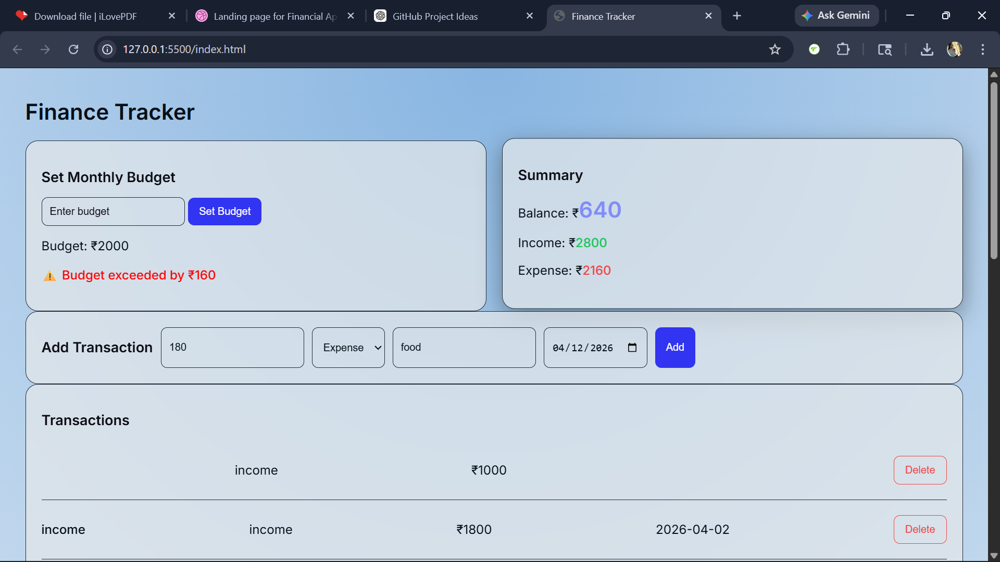
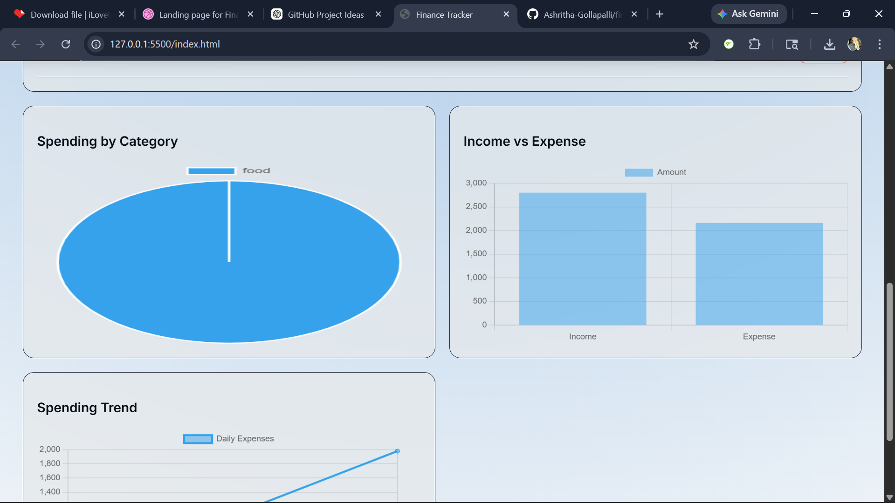

# 💰 Finance Tracker App

A modern finance tracking web application to manage income, expenses, and budgets with real-time analytics.

## 🚀 Live Demo
👉 https://ashritha-gollapalli.github.io/finance-tracker/

## ✨ Features
- Add & delete transactions
- Income vs Expense tracking
- Monthly budget system
- Budget exceeded alerts
- Data persistence using LocalStorage
- Interactive charts (Pie, Bar, Line)
- Modern UI with animations

## 🛠 Tech Stack
- HTML
- CSS (Modern UI + animations)
- JavaScript (ES6)
- Chart.js

## 📊 Functionality
- Tracks financial data in real-time
- Provides visual insights using charts
- Alerts user when budget exceeds
- Stores data locally in browser

  ###Screenshots

### Dashboard

### Charts



## 📦 Setup
```bash
git clone https://github.com/your-username/finance-tracker.git
cd finance-tracker
open index.html
click go live
